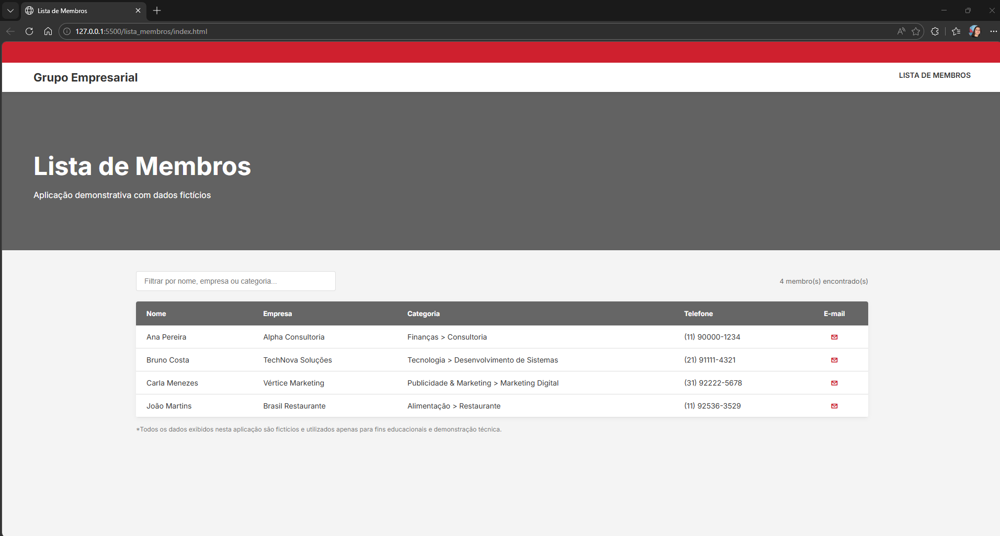

# 📇 Lista de Membros — Diretório Empresarial

Aplicação web para visualização e consulta de membros de um grupo empresarial, desenvolvida para demonstrar organização de dados, usabilidade e apresentação profissional.  
Todos os dados exibidos são **fictícios e anonimizados**, utilizados exclusivamente para fins de portfólio.

---

## ✨ Funcionalidades
- Listagem dinâmica de membros a partir de dados externos (JSON)
- Filtro em tempo real por nome, empresa, categoria ou telefone
- Contador automático de resultados encontrados
- Layout responsivo com suporte a telas menores

---

## 🛠️ Tecnologias
- **HTML5**
- **CSS3**
- **JavaScript**
- **JSON**

---

## 💡 Destaques técnicos
- Estrutura organizada com separação entre HTML, CSS, JS e dados
- Carregamento dinâmico dos dados com `fetch()`
- Filtro genérico utilizando `Object.values()` para busca em múltiplos campos
- Uso de CSS custom properties para padronização visual
- Aplicação de boas práticas de proteção de dados (LGPD)

---

## 📌 Observação
Este projeto simula um cenário real de uso corporativo e foi refatorado para portfólio, mantendo fidelidade técnica sem expor informações sensíveis.

---

## 🖥️ Preview

